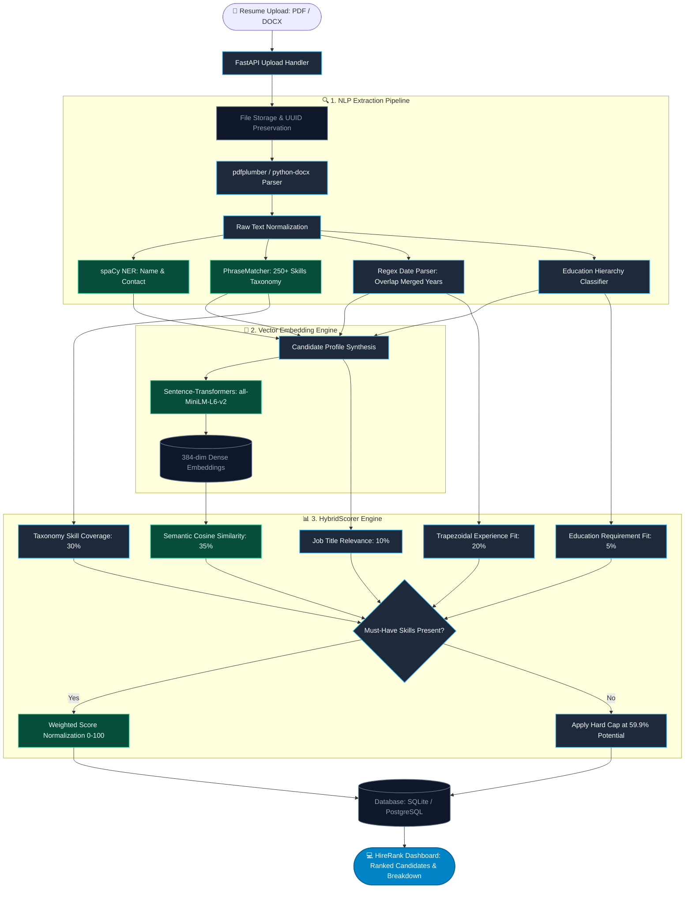

<div align="center">

# ⚡ HireRank — AI Recruitment & Resume Screening Platform

<p align="center">
  
  
  
  
  
  
</p>

**Autonomous, Explainable, Multi-Factor AI Candidate Ranking & NLP Screening Engine**

[](https://python.org)
[](https://fastapi.tiangolo.com)
[](https://react.dev)
[](https://www.typescriptlang.org/)
[](https://spacy.io)
[](https://huggingface.co/sentence-transformers/all-MiniLM-L6-v2)
[](LICENSE)

[✨ Features](#-key-features) • [🔄 Architecture & Flowchart](#-system-architecture--flowchart) • [📊 Hybrid Scoring Engine](#-5-pillar-hybrid-scoring-formula) • [🛠️ Tech Stack](#-tech-stack-details) • [📂 Repository Structure](#-repository-structure) • [🚀 Quick Start](#-quick-start) • [📡 API Reference](#-api-endpoints)

</div>

---

## 📌 Overview

**HireRank** is an enterprise-grade AI resume screening, ranking, and talent intelligence platform designed to replace legacy keyword-matching ATS systems. 

Instead of naive substring search (which overlooks qualified candidates with non-standard phrasing and rewards resume keyword stuffing), HireRank combines:
- **spaCy Named Entity Recognition (NER)** for contact and biographical detail extraction.
- **Rule-based temporal timeline parsing** for accurate, non-overlapping career tenure calculations.
- **Taxonomy-driven canonical phrase matching** (250+ tech skills with alias normalization).
- **Sentence-Transformers dense vector embeddings** (`all-MiniLM-L6-v2`) for deep semantic context comparison.
- **Explainable Hybrid Ranking Engine (`HybridScorer`)** with must-have skill capping, trapezoidal experience scoring, and zero black-box scoring.

HireRank also includes a **Guest Instant Triage Mode** (screen up to 5 resumes with zero login required), **AI-driven Technical Assessments**, **Recruiter Candidate Kanban Pipeline**, and **Team Workspace Collaboration**.

---

## ✨ Key Features

- 📑 **Universal Resume Ingestion**: High-fidelity text extraction supporting `.pdf` (with layout-aware `pdfplumber` and `pypdf` fallback) and `.docx` documents.
- 🧠 **Dual NLP Extraction Pipeline**:
  - **Entity Recognition (NER)**: Extracts candidate name, email, and phone number.
  - **Skills Taxonomy & Normalization**: 250+ canonical skills with automatic alias resolution (e.g., `K8s` $\rightarrow$ `Kubernetes`, `React.js` $\rightarrow$ `React`).
  - **Date Range Parsing & Overlap Merging**: Accurate career tenure calculation preventing double-counting of simultaneous positions.
  - **Education Level Ordinal Hierarchy**: Recognizes PhD $\rightarrow$ Master's $\rightarrow$ Bachelor's $\rightarrow$ Associate $\rightarrow$ High School.
- 🔢 **Standalone HybridScorer Engine**:
  - **35% Semantic Similarity**: 384-dimensional dense normalized embeddings via `all-MiniLM-L6-v2`.
  - **30% Skill Coverage**: Canonical set intersection with required and preferred skills.
  - **20% Trapezoidal Experience Fit**: 100% credit inside target experience band, gentle linear falloff outside.
  - **10% Title Relevance**: Semantic alignment between target job title and extracted candidate title.
  - **05% Education Match**: Ordinal degree requirement fit.
  - **Must-Have Skill Hard Cap (59.9%)**: Candidates missing any mandatory skill are strictly capped at 59.9 (Potential tier), preventing unqualified candidates from receiving top scores.
  - **Manual Review Safeguard**: Corrupted or unparseable files receive `needs_manual_review=True` and Tier `Needs Review` with no hallucinated scores.
- ⚡ **Guest Instant Triage Flow**: Screen up to 5 resumes instantly with live animated progress, tier breakdown, and one-click account creation to claim candidates into a persistent workspace.
- 🎯 **AI Skill Assessments**: Automatically generate role-specific multiple-choice assessments, dispatch invitations to candidates via email (Resend API / SMTP), and track completion scores.
- 📋 **Candidate Pipeline & Kanban**: Visual stage tracking (`Screened`, `Interview`, `Offer`, `Hired`, `Rejected`) with instant status transitions.
- 👥 **Team & Workspace Management**: Invite recruiters and hiring managers to your company domain with role-based permissions.
- 🎨 **Modern TalentRank UI**: Dark glassmorphic interface built with React, TypeScript, Tailwind CSS, and Framer Motion, featuring drag-and-drop queues, real-time polling, and candidate comparison slide-overs.
- 🔐 **Secure Authentication**: Stateless JWT auth with bcrypt password hashing, Google OAuth sign-in, and instant one-click demo login.

---

## 🔄 System Architecture & Flowchart



---

## 📊 5-Pillar Hybrid Scoring Formula

HireRank uses an explainable, 5-pillar composite scoring formula producing an objective score between $0.0$ and $100.0$:

$$\boxed{\text{Composite Score} = 0.35 \cdot S_{\text{semantic}} + 0.30 \cdot S_{\text{skills}} + 0.20 \cdot S_{\text{experience}} + 0.10 \cdot S_{\text{title}} + 0.05 \cdot S_{\text{education}}}$$

---

### 1️⃣ Semantic Similarity ($S_{\text{semantic}}$ — 35% Weight)
Measures conceptual relevance between candidate background and job requirements:
- **Model**: `all-MiniLM-L6-v2` produces unit-normalized vectors $\vec{u}_{\text{candidate}}, \vec{v}_{\text{job}} \in \mathbb{R}^{384}$.
- **Cosine Similarity**:
  $$\text{CosineSim}(\vec{u}, \vec{v}) = \frac{\vec{u} \cdot \vec{v}}{\|\vec{u}\| \|\vec{v}\|}, \quad \text{CosineSim} \in [-1.0, 1.0]$$
- **Normalized to $[0, 100]$**:
  $$S_{\text{semantic}} = \left(\frac{\text{CosineSim}(\vec{u}, \vec{v}) + 1}{2}\right) \times 100$$

### 2️⃣ Skills Match Ratio ($S_{\text{skills}}$ — 30% Weight)
Matches canonical skills and aliases against required and preferred criteria:
- Required skills are evaluated first with alias resolution (`['K8s', 'ReactJS']` $\rightarrow$ `{'Kubernetes', 'React'}`).
- Missing any required must-have skill activates the **Must-Have Hard Cap**:
  $$\text{Final Score} \le 59.9 \quad (\text{Tier} = \text{Potential})$$

### 3️⃣ Experience Fit ($S_{\text{experience}}$ — 20% Weight)
Uses a **trapezoidal target band** $[\text{min\_years}, \text{max\_years}]$:
- Inside target band $[\text{min}, \text{max}] \rightarrow 100\%$
- Below $\text{min\_years} \rightarrow$ Linear falloff to 0
- Above $\text{max\_years} \rightarrow$ Gentle overqualification penalty (capped at 50%)

### 4️⃣ Title Relevance ($S_{\text{title}}$ — 10% Weight)
Calculates token overlap and semantic alignment between target title and detected candidate title.

### 5️⃣ Education Hierarchy Fit ($S_{\text{education}}$ — 5% Weight)
Evaluates formal qualification against an ordinal scale:
$$\text{PhD} (5) > \text{Master's} (4) > \text{Bachelor's} (3) > \text{Associate} (2) > \text{High School} (1)$$

---

### 🎯 Score Tiers

| Score Range | Tier Classification | Badge | Action |
| :---: | :---: | :---: | :--- |
| **$\ge 75$** | 🟢 **Strong** | Emerald | Immediate shortlist for interview |
| **$55 – 74.9$** | 🟡 **Potential** | Amber | Proceed to screening round / review missing skills |
| **$< 55$** | 🔴 **Low** | Rose | Fundamental mismatch |
| **N/A** | ⚪ **Needs Review** | Purple | File unparseable or corrupted (zero hallucinated score) |

---

## 🛠️ Tech Stack Details

### 🖥️ Backend Infrastructure

| Technology | Purpose | Architectural Role |
| :--- | :--- | :--- |
| **Python 3.10–3.13** | Core Language | AI/NLP ecosystem and type annotations |
| **FastAPI** | REST API Engine | Asynchronous ASGI endpoints with auto OpenAPI docs |
| **Uvicorn** | Web Server | High-performance ASGI server |
| **SQLAlchemy 2.0** | ORM & DB Engine | Declarative models supporting SQLite and PostgreSQL |
| **Alembic** | DB Migrations | Controlled schema evolution |
| **Pydantic v2** | Data Validation | Request/response DTOs and strict schema validation |
| **spaCy (en_core_web_sm)**| NLP & NER | Candidate name, phone, email, and skill extraction |
| **sentence-transformers** | Embeddings | 384-dimensional dense vectors via `all-MiniLM-L6-v2` |
| **pdfplumber & pypdf** | PDF Ingestion | Layout-aware text extraction with fallback |
| **python-docx** | DOCX Ingestion | OpenXML document parsing |
| **Resend API / SMTP** | Email Delivery | Transactional candidate invite and alert emails |

---

### 🎨 Frontend Architecture

| Technology | Purpose | Highlights |
| :--- | :--- | :--- |
| **React 18.3** | UI Framework | Component-driven concurrent rendering |
| **TypeScript 5.0** | Type Safety | Strongly typed API contracts matching Pydantic schemas |
| **Vite 5.4** | Build Tool | Sub-second Hot Module Replacement (HMR) |
| **Tailwind CSS 3.4** | Styling | Dark glassmorphism, responsive grid layouts |
| **Framer Motion** | Animations | Smooth modal slide-overs, progress bars, transitions |
| **@react-oauth/google**| Authentication | Google One-Tap & Sign-In integration |
| **Axios** | HTTP Client | Bearer token interceptor and upload progress handlers |
| **React Router 6** | Routing | Protected routes with authentication guards |

---

## 📂 Repository Structure

```
HireRank/
│
├── 📁 backend/                             # FastAPI Application Backend
│   ├── 📁 app/
│   │   ├── 📁 core/                        # System Configurations & Security
│   │   │   ├── 📄 config.py                # Pydantic BaseSettings & Environment Variables
│   │   │   ├── 📄 database.py              # SQLAlchemy DB Engine & SessionLocal Factory
│   │   │   └── 📄 security.py              # Bcrypt Password Hashing & JWT Token Logic
│   │   │
│   │   ├── 📁 models/                      # SQLAlchemy 2.0 ORM Declarative Models
│   │   │   ├── 📄 user.py                  # Recruiter User Accounts & Domains
│   │   │   ├── 📄 job_posting.py           # Job Roles, Required Skills & Experience Req.
│   │   │   ├── 📄 candidate.py             # Candidate Profile, Raw Text & Embeddings
│   │   │   ├── 📄 match_score.py           # Multi-Factor Score Breakdowns & Unique Constraints
│   │   │   ├── 📄 assessment.py            # AI Skill Assessments & Candidate Test Taker
│   │   │   ├── 📄 team_member.py           # Workspace Invitations & Roles
│   │   │   └── 📄 guest_session.py         # Instant Triage Guest Screening Sessions
│   │   │
│   │   ├── 📁 schemas/                     # Pydantic Request/Response DTOs
│   │   │   ├── 📄 auth.py                  # Login, Signup & TokenResponse Models
│   │   │   ├── 📄 job_posting.py           # Job Creation & Detail Schemas
│   │   │   ├── 📄 candidate.py             # Candidate Data Transfer Objects
│   │   │   └── 📄 scoring.py               # MatchScore Read & Rerank Response Schemas
│   │   │
│   │   ├── 📁 routers/                     # FastAPI Endpoint Route Handlers
│   │   │   ├── 📄 auth.py                  # /auth/signup, /auth/login, /auth/google, /auth/demo-login
│   │   │   ├── 📄 jobs.py                  # /jobs/ CRUD Operations & Filtering
│   │   │   ├── 📄 candidates.py            # /jobs/{id}/upload, /candidates/{id}/status, pipeline update
│   │   │   ├── 📄 guest.py                 # /guest/screen, /guest/session/{id}, /guest/claim
│   │   │   ├── 📄 assessments.py           # /assessments/ CRUD, generate, invite, take & submit
│   │   │   └── 📄 settings.py              # /settings/ Workspace & Team Member Management
│   │   │
│   │   ├── 📁 services/                    # Machine Learning & NLP Core Engines
│   │   │   ├── 📄 extraction.py            # ResumeExtractor (NER, Date Parsing, PhraseMatcher)
│   │   │   ├── 📄 embeddings.py            # EmbeddingService (all-MiniLM-L6-v2 Singleton)
│   │   │   ├── 📄 scoring.py               # Legacy scorer reference
│   │   │   └── 📄 scoring_shared.py        # Canonical score_and_save implementation
│   │   │
│   │   ├── 📁 tasks/                       # Task Pipelines & Cleanup
│   │   │   ├── 📄 resume_tasks.py          # Asynchronous Background Processing Pipeline
│   │   │   └── 📄 cleanup.py               # Hourly Guest Session Data Retention Cleaner
│   │   │
│   │   ├── 📁 data/
│   │   │   └── 📄 skills_taxonomy.json     # 250+ Canonical Technical Skills & Known Aliases
│   │   └── 📄 main.py                      # FastAPI App Instantiation, CORS & Seed Data
│   │
│   ├── 📁 scoring/                         # Standalone Hybrid Scoring Engine
│   │   ├── 📄 scorer.py                    # HybridScorer, JobCriteria, ScoreBreakdown
│   │   ├── 📄 taxonomy.py                  # SkillsTaxonomy & Phrase Matching
│   │   └── 📄 extractor.py                 # ParsedResume & ExtractedProfile Dataclasses
│   │
│   ├── 📁 tests/                           # Pytest Automated Test Suite
│   │   ├── 📄 test_scoring.py              # Tests for 5-factor scoring & must-have cap
│   │   ├── 📄 test_extraction.py           # Tests for Contact, Skills, Dates, and Education
│   │   ├── 📄 test_phase2_endpoints.py     # Tests for Guest Screening & Status Polling
│   │   ├── 📄 test_assessments.py          # Tests for Assessment Generation & Submissions
│   │   └── 📄 test_delivery5_workspace.py  # Tests for Workspace Team Management
│   │
│   ├── 📁 uploads/                         # Resume File Storage
│   ├── 📄 requirements.txt                 # Backend Python Dependencies
│   ├── 📄 pytest.ini                       # Test Runner Configuration
│   └── 📄 .env.example                     # Environment Template
│
├── 📁 frontend/                            # React 18 + TypeScript Client Application
│   ├── 📁 src/
│   │   ├── 📁 api/
│   │   │   └── 📄 client.ts                # Axios Instance with JWT Interceptors & Typed API Methods
│   │   ├── 📁 context/
│   │   │   └── 📄 AuthContext.tsx          # Authentication Global State & Token Storage
│   │   ├── 📁 components/
│   │   │   ├── 📄 Sidebar.tsx              # Sticky Dark Navigation Sidebar
│   │   │   ├── 📄 ProtectedRoute.tsx       # Auth Guard for Recruiter Routes
│   │   │   ├── 📄 ScoreBar.tsx             # Animated Score Indicator Bars
│   │   │   ├── 📄 SkillTag.tsx             # Colored Skill Chips
│   │   │   └── 📄 StatusBadge.tsx          # Real-time Status Badges
│   │   ├── 📁 pages/
│   │   │   ├── 📄 MarketingPage.tsx        # High-Conversion Landing Page & Feature Showcase
│   │   │   ├── 📄 GuestTriagePage.tsx      # Instant Zero-Auth Resume Screening Screen
│   │   │   ├── 📄 ProcessingPage.tsx       # Real-Time Animated Processing Queue
│   │   │   ├── 📄 ResultsPreviewPage.tsx   # Guest Results, Tier Breakdown & Claim Account CTA
│   │   │   ├── 📄 LoginPage.tsx            # Recruiter Login & Demo Sign-In
│   │   │   ├── 📄 SignupPage.tsx           # Recruiter Registration
│   │   │   ├── 📄 DashboardPage.tsx        # Active Job Postings, Stats Counters & New Job Modal
│   │   │   ├── 📄 JobDetailPage.tsx        # Ranked Candidates Table & Slide-over Comparison Drawer
│   │   │   ├── 📄 UploadPage.tsx           # Multi-file Drag & Drop Processing Queue with Progress Bars
│   │   │   ├── 📄 CandidatePipelinePage.tsx# Candidate Kanban Pipeline Management
│   │   │   ├── 📄 AssessmentsPage.tsx      # AI Assessment Builder, Invites & Results
│   │   │   └── 📄 SettingsPage.tsx         # Workspace Settings & Team Collaboration
│   │   ├── 📄 App.tsx                      # Application Router Configuration
│   │   ├── 📄 main.tsx                     # React DOM Entrypoint
│   │   └── 📄 index.css                    # Tailwind Directives & Custom Animation Keyframes
│   │
│   ├── 📄 package.json                     # Frontend Dependencies & Scripts
│   ├── 📄 tsconfig.json                    # TypeScript Configuration
│   ├── 📄 tailwind.config.js               # Tailwind Color Palette & Theme Extensions
│   └── 📄 vite.config.ts                   # Vite Server & Backend Proxy Setup
│
├── 📄 docker-compose.yml                   # Containerized PostgreSQL (pgvector) + Redis Stack
├── 📄 .gitignore                           # Git Exclusion Rules
└── 📄 README.md                            # Comprehensive Documentation
```

---

## 🚀 Quick Start

### Prerequisites
- **Python 3.10+** (Tested on Python 3.11 & 3.13)
- **Node.js 18+** & **npm**
- **Git**

---

### 1️⃣ Clone the Repository
```bash
git clone https://github.com/atharv3046/HireRank.git
cd HireRank
```

---

### 2️⃣ Backend Setup

```bash
cd backend

# Install Python dependencies (use --prefer-binary on Windows)
pip install --prefer-binary -r requirements.txt

# Download spaCy English linguistic model
python -m spacy download en_core_web_sm

# Configure environment variables
copy .env.example .env     # Windows
# cp .env.example .env      # macOS/Linux

# Launch FastAPI Server
uvicorn app.main:app --port 8000
```
- **API Server**: `http://localhost:8000`
- **Interactive Swagger Docs**: `http://localhost:8000/docs`

---

### 3️⃣ Frontend Setup

In a separate terminal:

```bash
cd frontend

# Install npm packages
npm install

# Start Vite Development Server
npm run dev
```
- **Web Application**: `http://localhost:5173`

---

### 4️⃣ One-Click Demo Mode
1. Open `http://localhost:5173`.
2. Click **⚡ Enter Demo Dashboard** on the login page (or use the Hero CTA).
3. Open the pre-seeded **Senior Python Engineer** role.
4. Click **Upload Resumes** to test real-time parsing, vector embedding, and score generation!

---

## 📡 API Endpoints

| Method | Route | Description | Auth Required |
| :--- | :--- | :--- | :---: |
| `POST` | `/auth/demo-login` | Generates a demo recruiter session & token | ❌ |
| `POST` | `/auth/signup` | Registers a new recruiter account | ❌ |
| `POST` | `/auth/login` | Authenticates recruiter and returns JWT | ❌ |
| `POST` | `/auth/google` | Google OAuth token verification & login | ❌ |
| `POST` | `/guest/screen` | Instant screening of up to 5 resumes | ❌ |
| `GET` | `/guest/session/{id}` | Polls real-time progress for guest session | ❌ |
| `GET` | `/guest/session/{id}/results`| Returns full candidate rankings for guest session | ❌ |
| `POST` | `/guest/claim` | Transfers guest candidates to recruiter workspace | ✅ |
| `GET` | `/jobs/` | Lists all recruiter's job postings | ✅ |
| `POST` | `/jobs/` | Creates a new job posting with skill requirements | ✅ |
| `GET` | `/jobs/{id}` | Fetches detailed job specifications | ✅ |
| `PUT` | `/jobs/{id}` | Updates job criteria and requirements | ✅ |
| `DELETE`| `/jobs/{id}` | Removes job posting and associated candidates | ✅ |
| `POST` | `/jobs/{id}/upload` | Async multipart resume upload & background processing | ✅ |
| `GET` | `/jobs/{id}/candidates` | Retrieves ranked candidates with full score breakdowns | ✅ |
| `POST` | `/jobs/{id}/rerank-all` | Re-computes embeddings and scores across candidates | ✅ |
| `GET` | `/candidates/{id}/status`| Real-time polling endpoint for candidate processing state | ✅ |
| `GET` | `/assessments/` | Lists assessments for job postings | ✅ |
| `POST` | `/assessments/generate` | AI-generates assessment questions from job description | ✅ |
| `POST` | `/assessments/{id}/invite` | Sends email invitation to candidate | ✅ |
| `GET` | `/settings/members` | Lists team members in recruiter organization | ✅ |
| `POST` | `/settings/invites` | Invites a new team member with role | ✅ |

---

## 🧪 Running Automated Tests

Run the test suite with pytest:

```bash
cd backend
python -m pytest tests/test_scoring.py tests/test_extraction.py tests/test_phase2_endpoints.py -v
```

All 38+ unit and integration tests validate the scoring engine, skills extraction, date parsing, and guest screening flows.

---

## 📄 License

This project is licensed under the **MIT License** — see the [LICENSE](LICENSE) file for details.

<div align="center">
  <sub>Built with ❤️ for modern talent acquisition teams.</sub>
</div>
